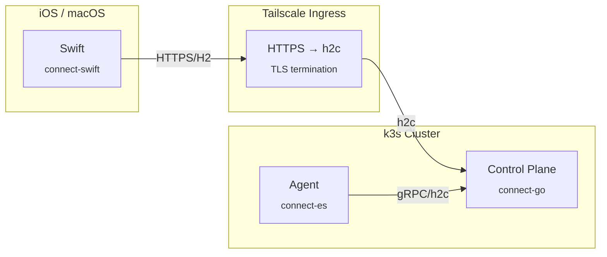

# Protocol Buffers

Protobuf definitions for Netclode's Connect RPC APIs. Uses [Buf](https://buf.build/) for code generation across Go, TypeScript, and Swift.

## Structure

```
proto/
├── buf.yaml           # Buf module configuration
├── buf.gen.yaml       # Code generation configuration
└── netclode/v1/
    ├── client.proto   # Client ↔ Control Plane API
    ├── agent.proto    # Agent ↔ Control Plane API
    ├── common.proto   # Shared types (Session, GitFileChange, etc.)
    └── events.proto   # Agent event types (tool_start, file_change, etc.)
```

## Services

### ClientService (`client.proto`)

Bidirectional streaming between iOS clients and control plane.

```protobuf
service ClientService {
  rpc Connect(stream ClientMessage) returns (stream ServerMessage);
}
```

Handles session management, prompts, terminal I/O, git operations, and port exposure.

### AgentService (`agent.proto`)

Bidirectional streaming between agents (running in sandboxes) and control plane.

```protobuf
service AgentService {
  rpc Connect(stream AgentMessage) returns (stream ControlPlaneMessage);
}
```

Agents connect TO the control plane (not the reverse) using their Kubernetes ServiceAccount token for authentication. Warm pool agents receive session config via pushed `SessionAssigned` messages.

## Code Generation

### Prerequisites

Install [Buf CLI](https://buf.build/docs/installation):

```bash
# macOS
brew install bufbuild/buf/buf

# or via npm
npm install -g @bufbuild/buf
```

### Generate Code

From the `proto/` directory:

```bash
buf generate
```

This generates code in three locations:

| Language | Output Directory | Plugins |
|----------|------------------|---------|
| Go | `services/control-plane/gen/` | protocolbuffers/go, grpc/go, connectrpc/go |
| TypeScript | `services/agent/gen/` | bufbuild/es (v2) |
| Swift | `clients/ios/Netclode/Generated/` | apple/swift, connectrpc/swift |

### Lint & Format

```bash
buf lint
buf format -w
```

### Breaking Change Detection

```bash
buf breaking --against '.git#branch=master'
```

## Connect RPC

We use [Connect](https://connectrpc.com/) instead of raw gRPC because:

- **Browser-native** - No gRPC-web proxy needed, works directly with fetch/XMLHttpRequest
- **HTTP/1.1 fallback** - Unary calls work over HTTP/1.1 when HTTP/2 isn't available
- **curl-friendly** - JSON encoding out of the box alongside binary protobuf

### Clients

| Platform | Library | Transport |
|----------|---------|-----------|
| Go (control-plane) | [connectrpc/connect-go](https://github.com/connectrpc/connect-go) | HTTP/2 (h2c internally, HTTPS via Tailscale) |
| TypeScript (agent) | [connectrpc/connect-es](https://github.com/connectrpc/connect-es) | gRPC over HTTP/2 (h2c) |
| Swift (iOS) | [connectrpc/connect-swift](https://github.com/connectrpc/connect-swift) | HTTP/2 over HTTPS |

### HTTP/2 Requirements

Connect bidirectional streaming requires HTTP/2. The architecture handles this:



- **iOS → Control Plane**: HTTPS with HTTP/2 via Tailscale Ingress
- **Agent → Control Plane**: h2c (HTTP/2 cleartext) within cluster

## Key Types

### SessionConfig

Configuration passed from control plane to agents on registration:

| Field | Description |
|-------|-------------|
| `session_id` | Unique session identifier |
| `workspace_dir` | Absolute path to workspace |
| `sdk_type` | SDK backend (Claude, OpenCode, Copilot, Codex) |
| `model` | Model ID (e.g., `claude-sonnet-4-0`, `ollama/qwen2.5-coder:32b`) |
| `ollama_url` | URL for local Ollama inference (optional) |
| `github_token` | GitHub token for git operations |
| `repos` | Repositories to clone |

### ModelInfo

Model metadata returned by `ListModels`:

| Field | Description |
|-------|-------------|
| `id` | Model identifier (e.g., `ollama/qwen2.5-coder:32b`) |
| `name` | Display name |
| `provider` | Provider name (anthropic, openai, ollama) |
| `downloaded` | For Ollama: whether model is downloaded locally |
| `size_bytes` | For Ollama: model size in bytes |

## Adding New Messages

1. Edit the appropriate `.proto` file
2. Run `buf generate` from the `proto/` directory
3. Run `buf lint` to check for issues
4. Update tests and documentation as needed

### Conventions

- Use `snake_case` for field names (protobuf convention)
- Use `oneof` for message unions (see `ClientMessage`, `ServerMessage`)
- Include timestamps as `google.protobuf.Timestamp`
- Add comments for non-obvious fields

## Generated Code Locations

After running `buf generate`:

```
services/control-plane/gen/netclode/v1/
├── client.pb.go                    # Go protobuf messages
├── client_grpc.pb.go               # Go gRPC stubs (unused)
├── netclodev1connect/
│   ├── client.connect.go           # Go Connect client/handler
│   └── agent.connect.go
├── agent.pb.go
├── common.pb.go
└── events.pb.go

services/agent/gen/netclode/v1/
├── client_pb.ts                    # TypeScript messages + service
├── agent_pb.ts
├── common_pb.ts
└── events_pb.ts

clients/ios/Netclode/Generated/netclode/v1/
├── client.pb.swift                 # Swift protobuf messages
├── client.connect.swift            # Swift Connect client
├── agent.pb.swift
├── agent.connect.swift
├── common.pb.swift
└── events.pb.swift
```
